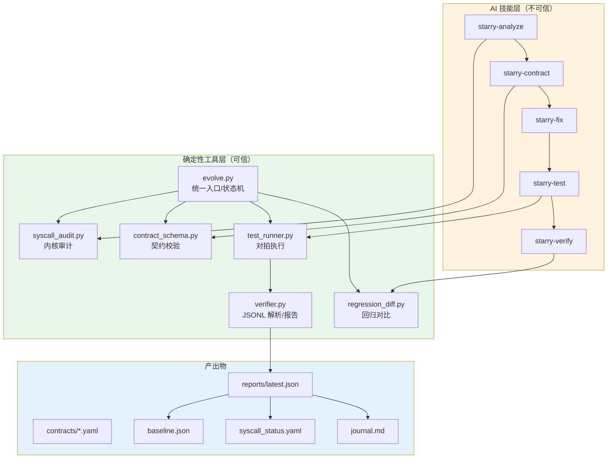

# starry-evolve：StarryOS 内核持续改进框架

## 1. 概述

`starry-evolve` 是一个面向 StarryOS 内核的自动化改进框架。核心理念：

> AI 提出契约、补丁、测试和解释；确定性工具决定变更是否通过验证。

框架当前围绕一条可运行的验证路径构建：**Linux Docker vs StarryOS QEMU 对拍验证器**。同一个 C 测试程序分别在 Linux（Docker 内通过 QEMU user mode 执行）和 StarryOS（QEMU system mode 执行）上输出结构化 JSONL 记录，由确定性 Python 工具按 case 逐一比对结果。

当前可运行的端到端展示路径：`syncfs` 在 `x86_64` 架构上的对拍验证。

框架代码位于：

- `scripts/starry-evolve/` — 核心工具链
- `.claude/skills/starry-*` — AI 工作流技能定义
- `.agents/skills/starry-*` — 同上，Agent 协议格式
- `.claude/settings.json` — 权限白名单和 hook 配置
- `AGENTS.md` — 仓库级 Agent 约束

## 2. 解决什么问题

StarryOS 是一个教学/研究用途的 OS 内核，其 syscall 实现存在三类问题：

1. **未实现（STUB）**：dispatch 表中有条目，handler 为 `todo!()` 或空函数，运行时会 panic。
2. **语义偏差（SEMANTIC_MISMATCH）**：函数存在，但返回值、errno、参数验证顺序等行为与 Linux 不一致。
3. **部分实现（PARTIAL）**：覆盖了主路径，但缺少边界情况处理。

手工修复这些问题需要反复查阅 Linux man page、编写测试、在 QEMU 中运行验证——周期长且容易遗漏。`starry-evolve` 将这个流程结构化为一组确定性工具和 AI 辅助技能，使得改进过程可复现、可审计。

## 3. 架构



分层原则：

- **AI 技能层**（橙色）：负责分析代码、生成契约、编写补丁和测试用例。产出物必须经过确定性工具验证。
- **确定性工具层**（绿色）：解析代码结构、校验契约格式、解析 JSONL、构建报告、对比基线。判定 PASS/FAIL 的逻辑只存在于这一层。
- **产出物**（蓝色）：YAML 契约、JSON 报告、基线文件、状态文件和日志。全部可人工审查。

## 4. 信任边界：AI 能决定什么，不能决定什么

框架的核心设计约束是**把「提出主张」和「验证主张」严格分开**。AI 在整个流程中扮演「提议者」角色——它可以分析代码、起草契约、生成补丁、编写测试，但它不能判定自己的产出是否正确。所有最终判定（PASS/FAIL、VERIFIED/TESTED）必须由确定性 Python 工具独立完成。

### 4.1 对拍机制：信任边界的物理基础

在展开信任边界的具体规则之前，需要先理解框架判定「通过」的物理过程——**对拍（pair comparison）**。后续所有规则（checksum、run_id、VERIFIED 不可手写）都围绕这个对拍过程设计。

对拍的核心思想：**同一个 C 测试程序运行两次，一次在 Linux 上作为参考基准（oracle），一次在 StarryOS 上，然后由确定性工具逐 case 比较两端的输出。**

```
                ┌─────────────────┐
                │  syncfs_pair.c  │  ← AI 编写的同一个 C 测试程序
                └───────┬─────────┘
                        │
            编译为同一个静态链接二进制
                        │
              ┌─────────┴─────────┐
              ▼                   ▼
    ┌─────────────────┐  ┌─────────────────┐
    │  Linux Docker   │  │  StarryOS QEMU  │
    │  (QEMU user)    │  │  (QEMU system)  │
    │                 │  │                 │
    │  输出 JSONL     │  │  输出 JSONL     │
    │  (oracle)       │  │  (被测对象)     │
    └────────┬────────┘  └────────┬────────┘
             │                    │
             └─────────┬──────────┘
                       ▼
              ┌─────────────────┐
              │   verifier.py   │  ← 确定性 Python 工具
              │                 │
              │  按 case_id     │
              │  配对对比       │
              │  ret/errno/     │
              │  observable     │
              └────────┬────────┘
                       ▼
              reports/latest.json
              每条 case: PASS 或 FAIL
```

关键约束：

1. **Linux 是 oracle**：两端输出不一致时，以 Linux 端为准。StarryOS 的行为如果与 Linux 不同，就是 FAIL。这不是 AI 的判断，而是 `verifier.py` 的 `evaluate_pairwise` 函数的字段相等性比较——`ret`、`errno`、`observable` 三个字段各自做 `==` 比较，全部相等才算 PASS。
2. **不接受终端文本**：两端的原始输出可能包含大量噪音（内核启动日志、`PASSED` 文字等）。只有结构化 JSONL 行（`type: starry_evolve_case`）被解析。终端里打印的 `PASS` 或 `PASSED` 字样会被显式忽略——如果所有 JSONL 解析失败而只有 PASSED 文本，最终判定为失败。
3. **checksum 防篡改**：每条 JSONL 记录的 `checksum` 字段是 `run_id + case_id + ret + errno + observable` 的 FNV-1a 64 哈希。`verifier.py` 用同样的算法重算并与记录中的值对比，不匹配则拒绝该条记录。
4. **run_id 隔离会话**：每次对拍生成随机 `run_id`，通过环境变量传入测试程序。只有携带当前 `run_id` 的 JSONL 记录才被接受，防止混入旧运行的输出。

理解了对拍机制之后，下面的信任边界规则就有了具体的参照：每一行都在回答「这个步骤中，哪些事只有对拍链路上的确定性工具可以做，AI 不能代替」。

### 4.2 信任边界总表

| 行为 | AI 的角色 | 确定性工具做什么 | 防范的风险 |
|------|----------|-----------------|-----------|
| 选择改进目标 | 调用工具并执行其输出 | `evolve.py select` 独立审计 + 排序，不接受 AI 输入 | AI 可能跳过真正有问题的 syscall |
| 定义 syscall 契约 | 起草 YAML 文件（无人/工具可自动生成） | `contract_schema.py` 校验结构（不校验语义） | AI 可能漏掉关键 case 或选错 compare 字段 |
| 编写内核补丁 | 生成 Rust 代码 | `cargo xtask clippy` / 编译验证 | AI 可能引入编译错误或 clippy 警告 |
| 编写测试用例 | 生成 C 代码 | `verifier.py` 解析 JSONL 并校验 checksum | AI 可能输出无法通过 checksum 校验的伪造结果 |
| 判定测试通过 | 不可 | `test_runner.py` 对比 Linux/StarryOS JSONL | AI 可能误读终端输出或凭印象声称通过 |
| 标记 VERIFIED 状态 | 不可 | `evolve.py record` 从 verifier report 派生 | AI 可能绕过验证直接声称完成 |
| 写入 journal 成功项 | 不可 | `evolve.py record` 从 verifier report 派生 | 同上，防止凭空捏造成功记录 |

下面从 4.3 起逐条展开解释每一行的具体含义。

### 4.3 选择改进目标：工具独立决定，AI 只是调用者

这一行和后面几行有一个本质区别：**AI 在目标选择上没有任何独立决策权**。

`evolve.py select` 不接受任何来自 AI 的输入参数。它的函数签名是 `choose_target(repo_root: Path) -> dict`，唯一入参是仓库路径。它的工作流程是：

1. 调用 `syscall_audit.py` 的 `run_audit`，该函数解析 `os/StarryOS/kernel/src/syscall/mod.rs` 的 dispatch 表，逐行匹配 `Sysno::XXX` 模式，定位到每个 handler 的函数体，检查其中是否包含 `todo!()`、`unimplemented!()`、`return Ok(0)` 等标记，输出结构化 JSON 列表（每条含 `sysno`、`status`、`handler`、`handler_file`、`handler_line`、`evidence`）。
2. 从审计结果中筛选 `status` 为 `STUB` 或 `PARTIAL` 的条目。
3. 按固定优先级排序：`STUB` 优先于 `PARTIAL`，同级别内按 `category` 再按 `sysno` 字母序。
4. 返回排序后的第一个候选。

AI 在实际工作流中的角色是**调用这个工具并执行其输出**。`starry-analyze` 技能的 SKILL.md 中明确写了"不要绕过统一入口直接进入修复"，也就是说 AI 被约束为必须使用 `evolve.py select` 的结果，而不是自己判断应该先修哪个 syscall。

这和其他阶段不同。在契约、补丁、测试阶段，AI 确实有独立的创作空间（起草 YAML、写代码），工具负责校验。但在目标选择阶段，AI 完全不参与决策——工具的输出就是最终决定。

### 4.4 定义契约：AI 起草，工具校验结构（有缺口）

**AI 做什么**：AI 查阅 Linux man page 和内核源码，为某个 syscall 起草一份 YAML 契约文件，定义若干测试 case 及其 `case_id` 和 `compare` 字段。框架中没有任何工具能自动生成契约——`contract_schema.py` 只有 `load`、`validate`、`render_markdown` 三个函数，没有 `generate` 或 `create`。契约内容完全依赖 AI 编写。

**工具做什么**：`contract_schema.py` 的 `validate_contract` 函数对 YAML 进行**结构**校验：
- 检查 `schema_version`、`syscall`、`status`、`cases` 四个顶层字段是否存在
- 检查 `status` 是否在允许值集合中
- 检查 `cases` 列表不为空、每个 case 有唯一的 `case_id`
- 检查每个 case 至少启用了 `ret`、`errno`、`observable` 中的一个用于对比
- 检查 `compare` 字典中没有未知的 key
- 检查 `unsupported` case 必须提供 `reason`

如果任何一个校验失败，抛出 `ContractError`，契约被拒绝，无法进入后续阶段。

**工具不做什么**：`validate_contract` 只检查「格式对不对」，不检查「内容够不够」。具体来说，它不检查：
- case 是否覆盖了该 syscall 的关键行为路径（如正常路径、各种错误码、边界值）
- `compare` 中启用的字段是否足够（例如只比较 `ret` 不比较 `errno`，可能漏掉返回值正确但 errno 错误的情况）
- `linux_sources` 中引用的 man page 或内核源码路径是否真实存在
- `observable` 字段的内容是否有意义

**这意味着什么**：契约是对拍的「规格」——它定义了哪些 case 要测、每个 case 比较哪些字段。如果规格本身有缺陷（漏掉了关键的错误路径 case，或者只比较了 `ret` 没比较 `errno`），那么即使对拍全 PASS，也不能说明 syscall 行为完全正确。

这是当前框架的一个已知情度缺口。缓解措施：
- 契约中必须填写 `linux_sources`，记录 Linux 行为的参考来源，便于人工审查
- `evolve.py contract --syscall <name> --render-markdown` 会将 YAML 渲染为可读的 Markdown，降低审查门槛
- 契约文件纳入 git 版本控制，变更可见

### 4.5 编写内核补丁：AI 生成，编译器验证

**AI 做什么**：AI 根据 YAML 契约修改 `os/StarryOS/kernel/src/syscall/` 下的 Rust 代码，实现或修复目标 syscall。

**工具做什么**：`cargo xtask clippy` 和 `cargo xtask starry build` 执行编译。如果 AI 生成的代码有语法错误、类型不匹配、或 clippy 能检测到的惯用法问题，编译会失败，补丁不会进入测试阶段。

**为什么不能只靠 AI**：Rust 编译器提供的类型安全保证超出了 AI 的可靠推理范围。特别是 `unsafe` 块中的指针操作、`ax_errno::LinuxError` 的错误码枚举值、以及 `starry_vm` 中的用户空间内存校验函数，都容易出现细微的错误。编译器是最终的类型检查者。

### 4.6 判定测试通过：最关键的信任边界

这是整个框架中最重要的一条边界。AI **绝不能**判定测试通过或失败。

**AI 做什么**：AI 编写 C 测试程序（如 `testcases/syncfs_pair.c`），该程序在运行时输出结构化 JSONL 记录。

**工具做什么**：判定过程由 `verifier.py` 的 `parse_jsonl_cases` 函数独立完成，具体执行以下步骤：

**第一步：过滤非 JSON 行。** 原始输出（特别是 StarryOS 的串口输出）会包含大量内核日志、启动信息等噪音。`parse_jsonl_cases` 逐行尝试 `json.loads`，解析失败的行直接跳过。特别地，如果一行包含 `PASS` 或 `PASSED` 文本但不是有效 JSON，它会被记录为 `unstructured success text ignored`——也就是说，**框架显式拒绝终端中的 PASSED 文本**。

**第二步：校验 JSONL 记录类型。** 只接受 `type` 字段为 `"starry_evolve_case"` 的记录。其他 JSON 对象（如内核日志中的 JSON 格式输出）被忽略。

**第三步：校验 run_id。** 每次验证会话生成一个随机 16 字符十六进制 `run_id`，通过环境变量 `STARRY_EVOLVE_RUN_ID` 传入测试程序。`parse_jsonl_cases` 拒绝所有 `run_id` 不匹配的记录。这防止了不同次运行的输出被混在一起，也防止了伪造的旧输出被注入。

**第四步：校验 case_id。** 只接受在契约 YAML `cases` 列表中定义过的 `case_id`。未知的 `case_id` 被拒绝。

**第五步：校验 checksum。** 这是最关键的防篡改步骤。对于每条记录，`verifier.py` 用 `run_id`、`case_id`、`ret`、`errno` 和 `observable` 的规范 JSON 字符串拼接后计算 FNV-1a 64 哈希，然后与记录中的 `checksum` 字段对比。如果两者不一致，该记录被拒绝（标记为 `checksum mismatch`）。

FNV-1a 64 的计算过程（对应 `testcases/syncfs_pair.c` 中的 C 实现和 `verifier.py` 中的 Python 实现）：

```
输入 = run_id + "\n" + case_id + "\n" + str(ret) + "\n" + str(errno) + "\n" + observable_json
哈希 = FNV-1a-64(输入)
```

两端使用完全相同的算法，确保：
- 如果 AI 修改了测试程序使其在 StarryOS 端伪造一个 `ret=-1, errno=9` 的结果，但实际 syscall 返回了不同的值，checksum 会对不上（因为 C 程序用实际的 syscall 返回值计算 checksum）。
- 如果有人直接在串口输出中注入一条伪造的 JSONL 行，但不知道当前的 `run_id`，该行会被第三步拒绝。
- 即使知道 `run_id` 并伪造了一条 checksum 正确的记录，仍然需要 Linux 端和 StarryOS 端的对应 case 结果完全一致（见下一步）。

**第六步：拒绝重复 case。** 同一个 `case_id` 出现多次时，只接受第一次，后续的被拒绝。这防止了通过重复输出来覆盖之前的结果。

**第七步：pair 对比。** 经过上述过滤后，`verifier.py` 的 `evaluate_pairwise` 函数按 `case_id` 将 Linux 端和 StarryOS 端的结果配对，然后按照契约 `compare` 字段中启用的字段逐一对比。**Linux 端是 oracle（参考基准）**——如果 StarryOS 的 `ret`、`errno` 或 `observable` 与 Linux 不一致，该 case 被标记为 `FAIL`。

**如果所有有效 JSONL 都被拒绝怎么办？** 如果原始输出中存在 `PASS`/`PASSED` 文本，但没有任何一条 JSONL 记录通过了上述校验（accepted 为空），那些 `PASS`/`PASSED` 文本会被追加到 rejected 列表中，最终判定为失败。换句话说，**没有有效 JSONL 支撑的 PASSED 声明等同于失败**。

### 4.7 标记 VERIFIED 状态和写入 journal：只有 report 可以触发

**AI 做什么**：不能做任何事。VERIFIED 状态不能由 AI 直接写入。

**工具做什么**：`evolve.py record --report <path>` 是唯一能更新状态的路径。它执行三重校验：

1. **字段完整性校验**：检查 report JSON 是否包含 `schema_version`、`run_id`、`syscall`、`target`、`success`、`git_diff_hash`、`case_results` 这七个必要字段。缺少任何一个，直接报错退出。
2. **Schema 版本校验**：检查 `schema_version` 是否等于当前工具支持的版本（`REPORT_SCHEMA_VERSION = 1`）。如果不匹配，报错退出——防止使用旧版本工具生成的 report。
3. **git diff hash 校验**：这是防止「过期 report」的关键。`verifier.py` 在生成 report 时会计算当前工作区 `git diff --binary HEAD` 的 SHA-256 哈希并写入 `git_diff_hash` 字段。`evolve.py record` 在记录时会重新计算当前工作区的 git diff hash，如果两者不匹配——意味着 report 对应的代码状态和当前代码状态不一致——则拒绝记录。

只有通过这三重校验后，`record` 才会：
- 将 `syscall_status.yaml` 中该 syscall 的 `status` 设为 `VERIFIED`（如果 report 中 `success=true`）或 `TESTED`（如果 `success=false`）
- 在 `journal.md` 中追加一条包含 `run_id`、`target`、`diff_hash`、两端 raw log hash 的记录
- 记录每个 case 的通过/失败状态到 `case_status` 字典

**为什么不允许 AI 手写 VERIFIED**：如果允许 AI 直接在 `syscall_status.yaml` 或 `journal.md` 中写入「VERIFIED」，那么整个确定性验证链就失去了意义——AI 可以在不运行任何测试的情况下声称某个 syscall 已经验证通过。强制要求从 verifier report 派生状态，保证了每一个 VERIFIED 标记都可以追溯到一次真实的对拍运行。

### 4.8 信任边界总结

```
AI 可以创作 ──────────────────────────────────────> 确定性工具验证
                                                                 │
（不参与，工具独立）──> evolve.py select 审计 + 排序              │
"契约如下..." ─────────> contract_schema.py 校验 schema           │
"这是补丁..." ─────────> cargo xtask clippy + 编译                │
"这是测试..." ─────────> verifier.py 校验 JSONL + checksum        │
                                                                 │
AI 不可以绕过 ─────────────────────────────────────── 验证直接写入
                                                                 │
"测试通过了"  ────────> 被拒绝，必须由 test_runner.py 对比 JSONL
"标记 VERIFIED" ──────> 被拒绝，必须由 evolve.py record 派生
"写入 journal" ───────> 被拒绝，必须由 evolve.py record 派生
```

## 5. 契约格式

契约以 YAML 文件存储在 `scripts/starry-evolve/contracts/<syscall>.yaml`。每个契约定义 syscall 的测试 case 以及哪些字段需要对比。

**不是**所有 syscall 都有契约。当前仅有 `sync` 和 `syncfs` 的示例契约。

示例（`contracts/syncfs.yaml`）：

```yaml
schema_version: 1
syscall: syncfs
status: CONTRACTED
linux_sources:
  - type: man-pages
    reference: "syncfs(2)"
    note: "syncfs(fd) synchronizes the filesystem containing fd."
  - type: linux-kernel
    reference: "fs/sync.c: SYSCALL_DEFINE1(syncfs, int, fd)"
    note: "Linux validates fd and returns EBADF for invalid descriptors."
cases:
  - case_id: syncfs_invalid_fd_ebadf
    description: "syncfs(-1) fails with EBADF"
    compare:
      ret: true
      errno: true
      observable: true
```

关键字段说明：

- `schema_version`：契约格式版本，`contract_schema.py` 据此校验。
- `cases[].case_id`：测试 case 的唯一标识，C 测试程序和 verifier 通过此 ID 对齐。
- `cases[].compare`：指定哪些字段参与 Linux/StarryOS 对比（`ret`、`errno`、`observable`）。
- `cases[].unsupported`：可选，标记 StarryOS 预期不支持的 case，对拍时跳过。
- `linux_sources`：信息性字段，记录 Linux 行为的参考来源。Linux 的实际运行时行为由 Docker 对拍确定，不在 YAML 中手写 oracle。

校验契约：

```sh
python3 scripts/starry-evolve/evolve.py contract --syscall syncfs
```

渲染为 Markdown：

```sh
python3 scripts/starry-evolve/evolve.py contract --syscall syncfs --render-markdown
# 生成 contracts/syncfs.md
```

## 6. Linux Docker vs StarryOS QEMU 对拍验证

这是框架的核心验证机制。

### 6.1 工作流程

1. **生成 run_id**：随机 16 字符十六进制字符串，通过环境变量 `STARRY_EVOLVE_RUN_ID` 传递给测试程序。
2. **Linux 端执行**：在 Docker 容器内通过 QEMU user mode 运行测试二进制。输出 JSONL 到 stdout。
3. **StarryOS 端执行**：通过 QEMU system mode 启动 StarryOS，以 `--shell-init-cmd` 执行测试二进制。从串口输出中捕获 JSONL。
4. **JSONL 解析**：`verifier.py` 从两端原始输出中提取 `type=starry_evolve_case` 的 JSON 记录，校验 run_id、case_id 和 checksum。
5. **逐 case 对比**：按契约 `compare` 字段，将 StarryOS 的 `ret`/`errno`/`observable` 与 Linux 端结果比较。**Linux 端是 oracle**。
6. **生成报告**：`test_runner.py` 将对比结果写入 `reports/`。

### 6.2 JSONL 记录格式

测试程序输出的每条记录：

```json
{"type":"starry_evolve_case","run_id":"a1b2c3d4e5f6a1b2","case_id":"syncfs_invalid_fd_ebadf","ret":-1,"errno":9,"observable":{"error":"EBADF"},"checksum":"a1b2c3d4e5f6a1b2"}
```

字段说明：

- `type`：必须为 `starry_evolve_case`，其他 JSON 行被忽略。
- `run_id`：与当前验证会话的环境变量匹配，防止混入无关输出。
- `case_id`：对应契约中的 case 标识。
- `ret`：syscall 返回值。
- `errno`：errno 值。
- `observable`：自由格式的 JSON，由契约 `compare.observable` 决定是否参与对比。
- `checksum`：FNV-1a 64 哈希，输入为 `run_id\ncase_id\nret\nerrno\nobservable_json`。

### 6.3 拒绝规则

`verifier.py` 的 `parse_jsonl_cases` 会拒绝以下记录：

- `type` 不是 `starry_evolve_case`
- `run_id` 不匹配当前会话
- `case_id` 不在契约定义中
- `ret` 或 `errno` 无法解析为整数
- checksum 与重算结果不一致
- 同一 `case_id` 出现多次

如果原始输出中包含 `PASS`/`PASSED` 文本但没有任何有效的 JSONL 记录，这些文本会被报告为 `unstructured success text ignored`，最终判定为失败。

## 7. 端到端演示：`syncfs`

当前唯一可运行的端到端展示是 `syncfs` 在 `x86_64` 上的对拍。

### 7.1 前置检查

```sh
python3 scripts/starry-evolve/evolve.py doctor
```

输出框架资产完整性和 Docker 环境检查结果。

### 7.2 查看当前状态

```sh
python3 scripts/starry-evolve/evolve.py status
```

显示已注册契约、基线 case 数量和最新 verifier report 状态。

### 7.3 运行完整对拍

```sh
scripts/starry-evolve/run_syncfs_pair.sh x86_64
```

该脚本执行以下步骤：

1. 调用 `prepare_pair_test.sh x86_64 syncfs`，编译 `testcases/syncfs_pair.c` 并注入 StarryOS rootfs。
2. 调用 `evolve.py test`，启动 Linux Docker 侧（QEMU user mode）和 StarryOS QEMU system mode 侧。
3. 两端执行同一个 `starry-evolve-syncfs` 二进制，输出 JSONL。
4. `test_runner.py` 解析、对比、生成报告。

成功后产出：

```
scripts/starry-evolve/reports/latest.json
scripts/starry-evolve/reports/<date>_syncfs_x86_64_<run_id>.json
scripts/starry-evolve/reports/<date>_syncfs_x86_64_<run_id>.linux.log
scripts/starry-evolve/reports/<date>_syncfs_x86_64_<run_id>.starry.log
```

### 7.4 记录结果到状态文件

```sh
python3 scripts/starry-evolve/evolve.py record --report scripts/starry-evolve/reports/latest.json
```

此命令：
- 校验 report 的 schema 版本和 `git_diff_hash`
- 更新 `syscall_status.yaml` 中该 syscall 的状态（VERIFIED 或 TESTED）
- 在 `journal.md` 中追加带 run_id 的条目

### 7.5 选择下一个改进目标

```sh
python3 scripts/starry-evolve/evolve.py select
```

基于 `syscall_audit.py` 的审计结果，从 STUB 和 PARTIAL 的 syscall 中按优先级排序，输出候选目标及其当前状态、handler 位置和推荐下一阶段。

## 8. 技能和 Agent 工作流

框架定义了六个 AI 技能，位于 `.claude/skills/starry-*/SKILL.md`（同时有 `.agents/skills/` 下的镜像）。每个技能对应改进循环中的一个阶段。

### 8.1 技能列表

| 技能 | 职责 | 触发条件 |
|------|------|----------|
| `starry-analyze` | 审计 syscall 覆盖率，分类实现状态 | "analyze starry"、"syscall audit" |
| `starry-contract` | 提取 Linux 行为契约，生成 YAML | "check contract"、"对比 Linux 行为" |
| `starry-fix` | 根据契约实现或修复 syscall | "fix sys_X"、"implement syscall" |
| `starry-test` | 生成和运行 JSONL 测试用例 | "test syscall"、"write test" |
| `starry-verify` | 跨架构构建和回归验证 | "verify starry"、"run regression" |
| `starry-iterate` | 完整自主迭代循环 | "iterate on starry"、"持续改进" |

### 8.2 迭代循环

`starry-iterate` 编排完整循环：

```
ANALYZE → CONTRACT → FIX → TEST → VERIFY → RECORD
```

可与 `/loop` 配合实现多轮自主改进。每轮只修改一个 syscall，失败不超过 2 次重试。

### 8.3 子 Agent

迭代流程中可派生两个子 Agent：

- `regression-watcher.yaml`：检测内核变更引入的回归，报告 BUILD/VERIFIER_REPORT/REGRESSIONS/IMPROVEMENTS。
- `syscall-reviewer.yaml`：对照契约 YAML 审查 syscall 实现，检查参数处理、错误码、返回值、用户空间内存访问和边界情况。

两个子 Agent 的输出必须引用契约 `case_id`，不允许无依据的 PASS 判定。

## 9. Hook 和权限模型

### 9.1 权限白名单

`.claude/settings.json` 定义了最小权限集：

```json
{
  "permissions": {
    "allow": [
      "Bash(cargo xtask *)",
      "Bash(python3 scripts/starry-evolve/evolve.py *)",
      "Bash(scripts/starry-evolve/run_syncfs_pair.sh *)",
      "Bash(git log *)",
      "Bash(git diff *)",
      "Bash(git status *)"
    ]
  }
}
```

只有列出的命令模式被自动允许执行，其他命令需要用户确认。

### 9.2 Hook

| 事件 | Hook | 职责 |
|------|------|------|
| `SessionStart` | `hooks/session_context.py` | 加载会话上下文 |
| `Stop` | `hooks/pre_commit_check.py` | 在 Agent 停止前检查是否有未验证的内核变更，防止提交未通过 verifier 的修改 |

`pre_commit_check.py` 作为安全网：如果 Agent 尝试在内核变更未经 verifier 验证的情况下结束会话，hook 会发出警告。

## 10. 报告、基线、日志和状态文件

### 10.1 文件清单

| 文件 | 位置 | 说明 |
|------|------|------|
| verifier report | `reports/<date>_<syscall>_<arch>_<run_id>.json` | 完整对拍结果 |
| latest report | `reports/latest.json` | 最近一次运行的 symlink（内容复制） |
| raw log（Linux） | `reports/<...>.linux.log` | Linux Docker 侧完整 stdout |
| raw log（StarryOS） | `reports/<...>.starry.log` | StarryOS QEMU 侧完整串口输出 |
| 基线 | `baseline.json` | syscall/target/case 级别的基线快照 |
| 状态文件 | `syscall_status.yaml` | 各 syscall 当前状态（VERIFIED/TESTED/ANALYZED/CONTRACTED） |
| 日志 | `journal.md` | 按时间排列的验证记录，每条包含 run_id 和 diff hash |

### 10.2 报告内容

`reports/latest.json` 包含：

```json
{
  "schema_version": 1,
  "mode": "linux_starry_pair",
  "run_id": "...",
  "timestamp": "...",
  "syscall": "syncfs",
  "target": "x86_64",
  "success": true,
  "contract_hash": "<sha256 of contract YAML>",
  "git_diff_hash": "<sha256 of current git diff>",
  "source_hash": "<sha256 of test C source>",
  "binary_hash": "<sha256 of compiled binary>",
  "linux": {
    "command": "...",
    "exit_code": 0,
    "raw_log_hash": "...",
    "rejected_lines": []
  },
  "starry": {
    "command": "...",
    "exit_code": 0,
    "raw_log_hash": "...",
    "rejected_lines": []
  },
  "case_results": [
    {
      "case_id": "syncfs_invalid_fd_ebadf",
      "status": "PASS",
      "matched": true,
      "linux": {"ret": -1, "errno": 9, "observable": {"error": "EBADF"}},
      "starry": {"ret": -1, "errno": 9, "observable": {"error": "EBADF"}}
    }
  ]
}
```

`git_diff_hash` 的作用是防止过期报告被 `evolve.py record` 接受——如果当前工作区的 diff hash 与报告中的不一致，`record` 会拒绝。

### 10.3 基线与回归

`baseline.json` 存储 case 级别的通过/失败快照。`regression_diff.py` 将新报告与基线对比：

- 只有**同一 syscall/target/case 从通过变失败**才算回归（fail → pass 是改进，新增 case 不算回归）。
- `evolve.py verify` 调用 `regression_diff.py` 执行回归检测。

更新基线：

```sh
python3 scripts/starry-evolve/evolve.py test \
  --syscall syncfs --target x86_64 \
  --linux-command '...' --starry-command '...' \
  --update-baseline
```

只有全部 case 通过时才允许更新基线。

### 10.4 `reports/` 目录

`reports/.gitignore` 内容为 `*`，即所有报告文件被 git 忽略。报告是生成的中间产物，不应进入版本控制。唯一需要纳入版本控制的是 `reports/.gitignore` 本身。

## 11. 如何添加下一个 Syscall

以添加 `fstat` 为例：

### 11.1 审计当前实现

```sh
python3 scripts/starry-evolve/evolve.py audit --format markdown
```

确认 `fstat` 在审计输出中的状态（STUB/PARTIAL/IMPLEMENTED）。

### 11.2 创建契约

创建 `scripts/starry-evolve/contracts/fstat.yaml`：

```yaml
schema_version: 1
syscall: fstat
status: CONTRACTED
linux_sources:
  - type: man-pages
    reference: "fstat(2)"
  - type: linux-kernel
    reference: "fs/stat.c: SYSCALL_DEFINE2(fstat, int, fd, struct __old_kernel_stat __user *, statbuf)"
cases:
  - case_id: fstat_valid_fd
    description: "fstat(valid_fd, &buf) returns 0"
    compare:
      ret: true
      errno: true
      observable: true
  - case_id: fstat_invalid_fd_ebadf
    description: "fstat(-1, &buf) returns -1 with EBADF"
    compare:
      ret: true
      errno: true
      observable: true
  # ... 更多 case
```

校验并渲染 Markdown：

```sh
python3 scripts/starry-evolve/evolve.py contract --syscall fstat --render-markdown
```

### 11.3 编写测试程序

创建 `scripts/starry-evolve/testcases/fstat_pair.c`，参考 `testcases/syncfs_pair.c` 的模板：

- 使用 `getenv("STARRY_EVOLVE_RUN_ID")` 获取 run id
- 为每个 case 调用 `emit_case(run_id, case_id, ret, err, observable_json)`
- `case_id` 必须与 YAML 中定义的完全一致

### 11.4 编写执行脚本

参考 `run_syncfs_pair.sh`，创建 `run_fstat_pair.sh`：

- 调用 `prepare_pair_test.sh` 编译并注入 rootfs
- 调用 `evolve.py test --syscall fstat --target x86_64 --linux-command '...' --starry-command '...'`

### 11.5 运行验证

```sh
scripts/starry-evolve/run_fstat_pair.sh x86_64
python3 scripts/starry-evolve/evolve.py record --report scripts/starry-evolve/reports/latest.json
```

## 12. 测试框架自身

框架的测试位于 `scripts/starry-evolve/tests/`。

```sh
# 使用 Python unittest 直接运行（不需要 pytest）
python3 scripts/starry-evolve/tests/test_verifier.py

# 如果安装了 pytest，也可以
pytest scripts/starry-evolve/tests/
```

`test_verifier.py` 覆盖：

- JSONL 解析和 checksum 校验
- 拒绝规则（错误 run_id、未知 case_id、checksum 不匹配、重复 case）
- pair 对比逻辑
- 报告构建和文件命名

`pytest` 是可选依赖；`test_verifier.py` 使用标准库 `unittest`，可以直接用 `python3` 运行。

## 13. 当前限制

- **契约完全由 AI 编写，无工具可自动生成**：`contract_schema.py` 只有 `load`、`validate`、`render_markdown` 三个函数，没有 `generate` 或 `create`。契约 YAML 的内容（case 覆盖哪些行为、compare 哪些字段）完全依赖 AI，工具只校验结构不校验语义。如果 AI 漏掉了关键的错误路径 case，对拍全 PASS 也不能保证实现完全正确。
- **契约覆盖面**：仅 `sync` 和 `syncfs` 有 YAML 契约。其他 syscall 尚未建立契约。
- **对拍演示**：`run_syncfs_pair.sh` 仅支持 `x86_64`。其他架构（`riscv64`、`aarch64`、`loongarch64`）的对拍脚本尚未就绪。
- **测试 case 深度**：`syncfs` 契约只有一个 case（`syncfs_invalid_fd_ebadf`）。正常路径、信号中断、大文件描述符等 case 尚未覆盖。
- **依赖 Docker**：Linux 侧 oracle 通过 Docker + QEMU user mode 执行，需要本地 Docker 环境。
- **单 case 对比粒度**：当前只对比 `ret`、`errno`、`observable` 三个字段。`observable` 是自由格式 JSON，没有 schema 约束。
- **状态文件手动流转**：`evolve.py record` 需要手动调用，不会在对拍完成后自动触发。

## 14. 路线图

方向性规划，按优先级排列：

1. **扩展 case 覆盖**：为 `syncfs` 添加正常路径、EBADF 以外的错误码、信号中断等 case。为 `sync` 建立对拍 case。
2. **多架构对拍**：为 `riscv64` 和 `aarch64` 建立 `run_<syscall>_pair.sh` 脚本，解决交叉编译和 rootfs 注入问题。
3. **批量 syscall 契约**：选择高频 syscall（如 `read`、`write`、`fstat`、`mmap`），建立契约和对拍流程。
4. **observable schema 约束**：在契约 YAML 中为 `observable` 字段定义结构 schema，替代当前的自由格式 JSON。
5. **自动 record**：对拍完成后自动调用 `evolve.py record`，减少手动步骤。
6. **CI 集成**：将对拍验证集成到 CI 流水线，在 PR 中自动运行 verifier 并报告结果。
7. **基线演化**：支持多版本基线管理，区分预期行为变更（改进）和非预期回归。
